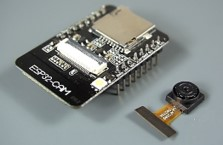
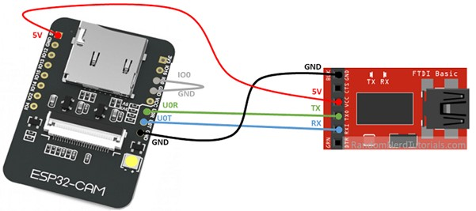
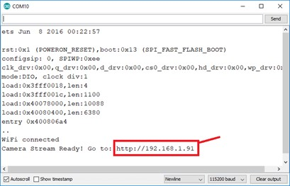

# ESP32 Camera for multiple clients
This is a generic description for an ESP32 Cam which can be used in multiple use cases.

## Description and operation instructions
..

 ## Technical description
..

### Parts
1 x ESP32-Cam

•	Dupont connectors
•	Cables
•	TTL USB to 232
•	Breadboard
•	Jumper wires
•	5V power supply for ESP32-CAM
•	Heat block

### Schematic overview to upload code to the ESP32-CAM

### Firmware installation 
Connect the ESP32-Cam to the FTDI:
Many FTDI programmers have a jumper that allows you to select 3.3V or 5V. Make sure the jumper is in the right place to select 5V.
ESP32-CAM	FTDI Programmer
GND	        GND
5V	        VCC (5V)
U0R	        TX
U0T	        RX
GPIO 0	    GND
Important: 
•	GPIO 0 needs to be connected to GND so that you’re able to upload code.
•	Make sure to connect an external power supply to the 5V otherwise there are errors when flashing or the flashing will not work at all.

To upload the code, follow the next steps in ArduinoIDE:
1) Go to Tools > Board and select AI-Thinker ESP32-CAM.
2) Go to Tools > Port and select the COM port the ESP32 is connected to.
3) Then, click the upload button to upload the code.
4) When you start to see these dots on the debugging window as shown below, press the ESP32-CAM on-board RST button.

After a few seconds, the code should be successfully uploaded to your board.
When successfully uploaded remove the GND 0100 cable and reset the ESP CAM

### Getting the IP address
After uploading the code, disconnect GPIO 0 from GND. Open the Serial Monitor at a baud rate of 115200. Press the ESP32-CAM on-board Reset button.
The ESP32 IP address should be printed in the Serial Monitor.

### Accessing the video stream
Now, you can access your camera streaming server on your local network. Open a browser and type the ESP32-CAM IP address http://192.168.x.x/mjpeg/1. A page with the current video streaming should load.

### Home Assistant integration
.. 

### 3D printer files
Thingiverse

### Interface
#### Home Assistant
Home Assistant is connected via the MQTT broker.

### Testing
Test command to turn the relay on: `http://192.168.201.64/control?cmd=gpio,13,1` 13 = D7

### Information
- [DHT11 and DHT22](https://espeasy.readthedocs.io/en/latest/Plugin/P005.html)

Generic
- [Markdown Cheat Sheet](https://www.markdownguide.org/cheat-sheet/)

### Problems
..

### Wishlist
..

### Code
Is stored in 'ESP32_CAM_MultiClient.ino.'